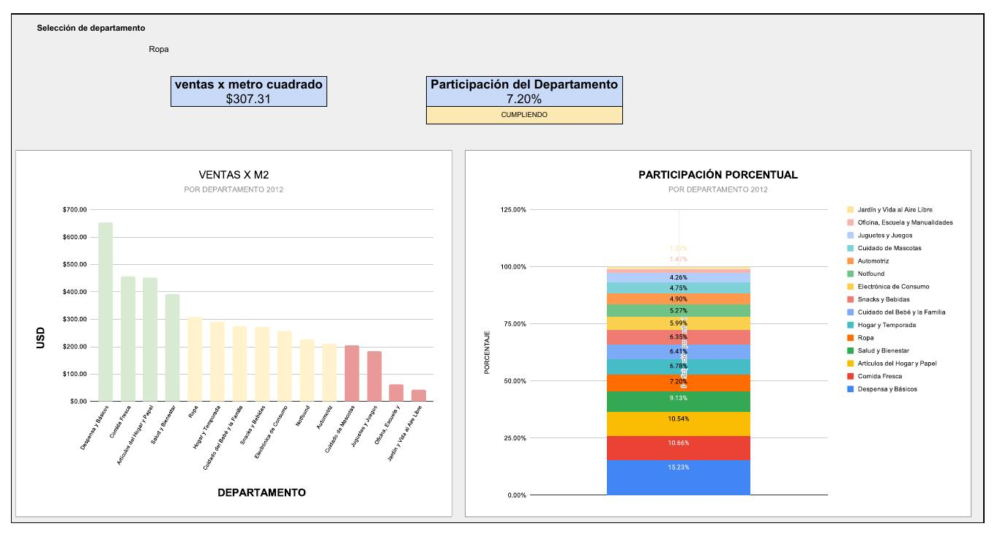
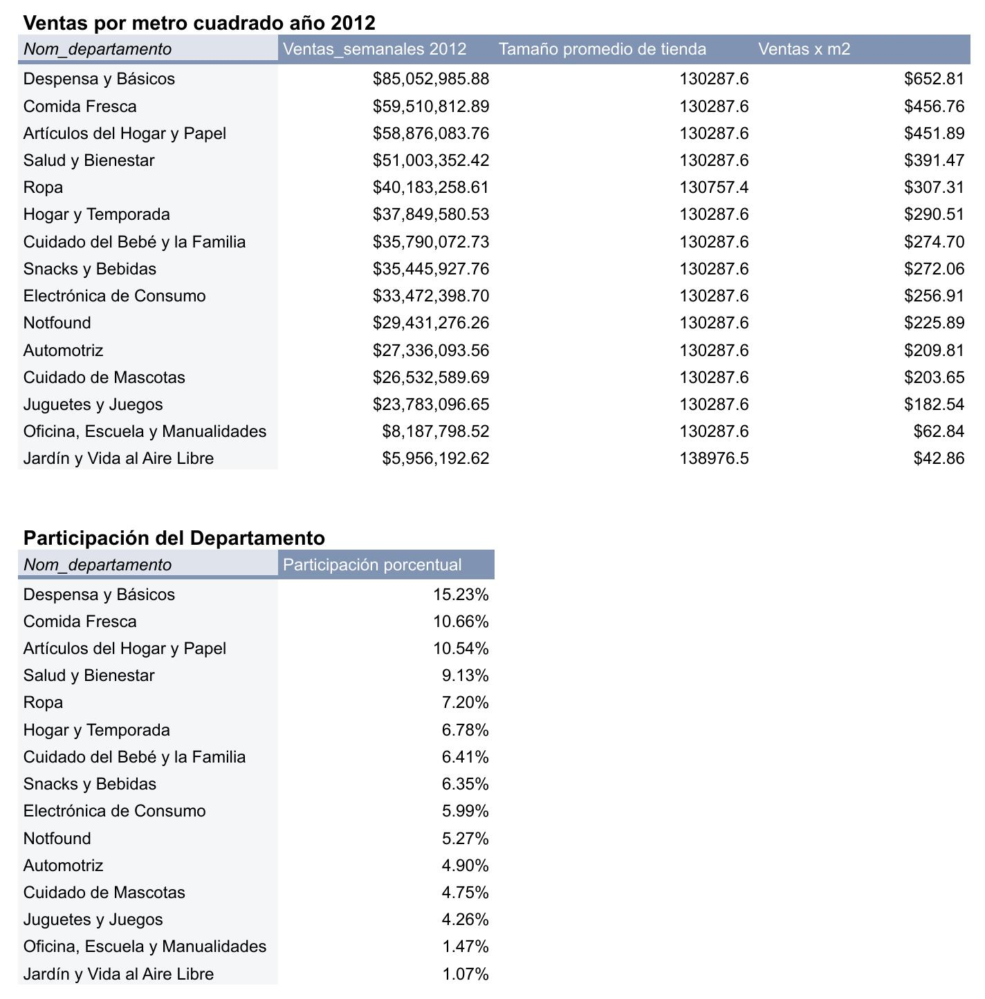
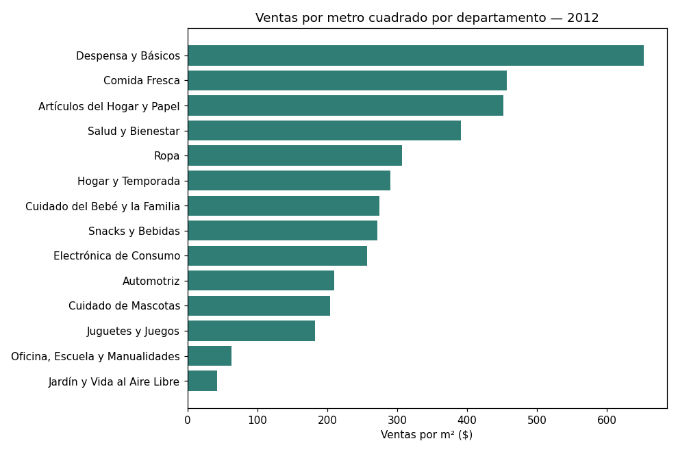
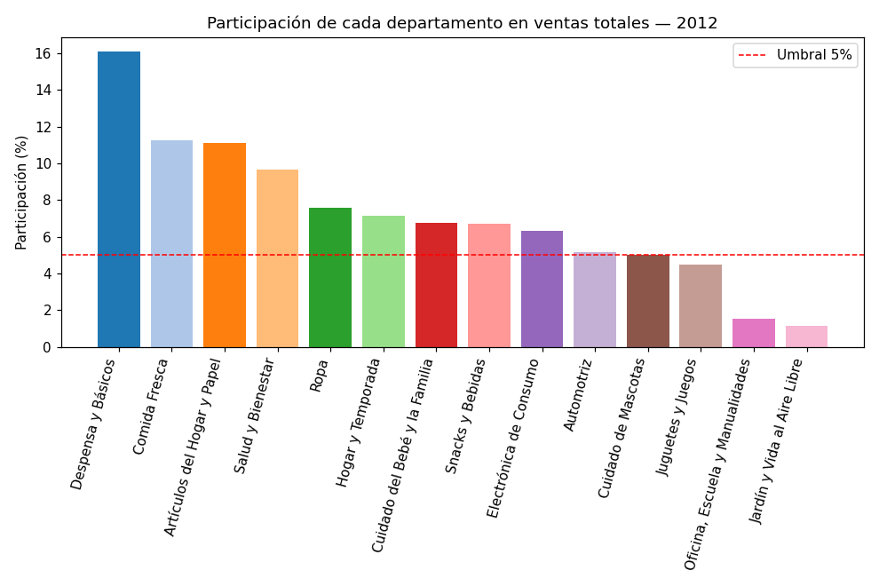

# Walmart — Resumen Ejecutivo de Ventas

Resumen ejecutivo de ventas semanales de Walmart en 2012, con KPIs de eficiencia y participación por departamento, construido en Google Sheets/Excel para apoyar decisiones de presupuesto e inventario de la Dirección Comercial.

## Contexto

La Dirección Comercial necesitaba responder dos preguntas centrales:
- ¿Qué categorías de departamento fueron más eficientes para generar ventas en 2012?
- ¿Qué departamentos aportaron más al negocio y cuáles estuvieron por debajo de su potencial?

**Datasets**: `raw_ventas` (transaccional: tienda, departamento, fecha, ventas semanales, feriado), `raw_departamento` (catálogo de nombres de departamento) y `raw_tiendas` (catálogo de tipo A/B/C y tamaño en m² por tienda).

## Metodología

1. **Limpieza** (`clean_ventas`): normalización de formato de fecha y de `ventas_semanales`
2. **Enriquecimiento**: unión con `BUSCARV`/`VLOOKUP` de tipo, tamaño y nombre de departamento a la tabla transaccional
3. **Tablas dinámicas** (`Pivot`) filtradas a 2012:
   - **KPI 1 — Ventas por m²**: `SUMA(ventas_semanales) / PROMEDIO(tamaño)` por departamento (campo calculado)
   - **KPI 2 — Participación por departamento**: ventas del departamento como % de las ventas totales
4. **Dashboard** interactivo con menú desplegable por departamento, KPIs enlazados vía `BUSCARV` y formato condicional (participación <5% resaltada)
5. **Resumen ejecutivo** con el método **Context → Finding → Implication (C→F→I)** para cada pregunta de negocio
6. **QA**: validaciones documentadas en la hoja `README` sobre tiendas sin departamento, ventas negativas/nulas y tamaños en m² inválidos

## Resultados

**KPI 1 — Ventas por m² (2012)**: Despensa y Básicos, Comida Fresca y Artículos del Hogar y Papel lideran en eficiencia por metro cuadrado; Jardín y Vida al Aire Libre y Oficina/Escuela/Manualidades son los menos eficientes.

**KPI 2 — Participación en ventas totales (2012)**: Despensa y Básicos (15.23%), Comida Fresca (10.66%) y Artículos del Hogar y Papel (10.54%) concentran la mayor participación. Jardín y Vida al Aire Libre (1.07%) y Oficina, Escuela y Manualidades (1.47%) están por debajo del umbral de 5% considerado meta mínima.

## Resumen ejecutivo (C→F→I)

**P1 — ¿Qué departamentos fueron más eficientes generando ventas en 2012?**
Despensa y Básicos, Cuidado Personal y Cuidado del Bebé presentan las mayores ventas por m², por productos de alta rotación y compra recurrente → se recomienda priorizar presupuesto, inventario y espacio comercial en estos departamentos para maximizar ventas sin ampliar el área de tienda.

**P2 — ¿Qué departamentos aportaron más y cuáles están por debajo de su potencial?**
Despensa y Básicos, Comida Fresca y Salud y Bienestar concentran la mayor participación; Jardín y Vida al Aire Libre, Oficina/Escuela y Juguetes están por debajo del 5% esperado → se recomienda asegurar disponibilidad de inventario en los departamentos top y revisar surtido, espacio o activaciones estacionales en los de baja participación.

## QA / Validaciones

| Chequeo | Resultado |
|---|---|
| Tiendas sin departamento asignado (histórico) | 6,435 filas |
| Tiendas sin departamento asignado (2012) | 1,935 filas |
| Ventas negativas (histórico) | 27 filas |
| Ventas negativas (2012) | 10 filas |
| Tamaños en m² en 0 o vacíos | 0 |

Las filas sin departamento asignado (`Notfound`) se excluyeron del análisis por KPI para no distorsionar los resultados.

## Visualizaciones

**Dashboard interactivo** (selección: departamento "Ropa" → $307.31 ventas x m², 7.20% participación — CUMPLIENDO):



**Tabla dinámica de ventas por m² (2012)**:



**Gráficas de apoyo** (calculadas a partir de los datos crudos, mismos valores que el pivot):

| Ventas por m² | Participación por departamento |
|---|---|
|  |  |

## Herramientas

Google Sheets / Excel — tablas dinámicas, campos calculados, `BUSCARV`/`VLOOKUP`, formato condicional, validación de datos.

## Estructura del repo

```
walmart-executive-sales-summary/
├── Resumen_Ejecutivo_Ventas_Walmart.xlsx
├── images/
└── README.md
```
